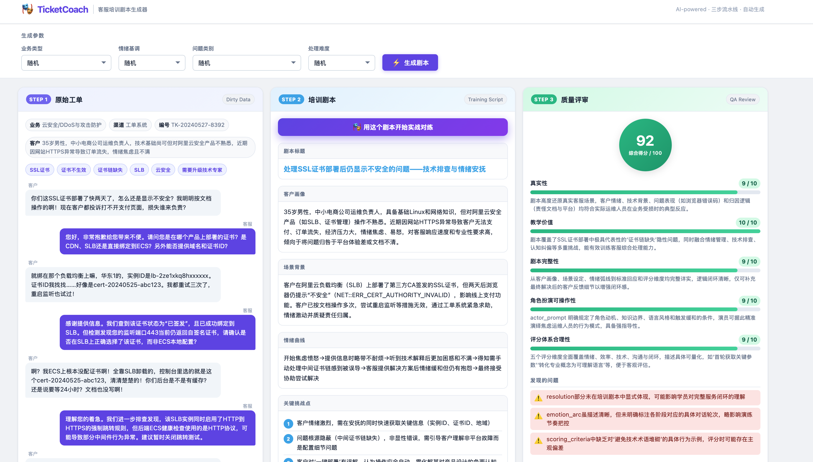
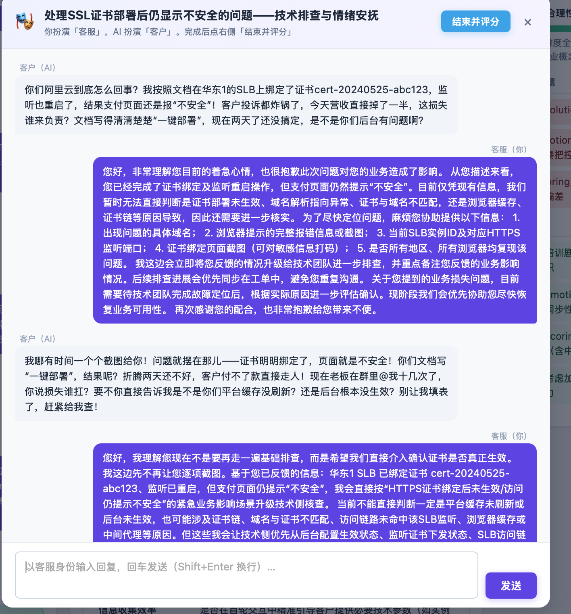
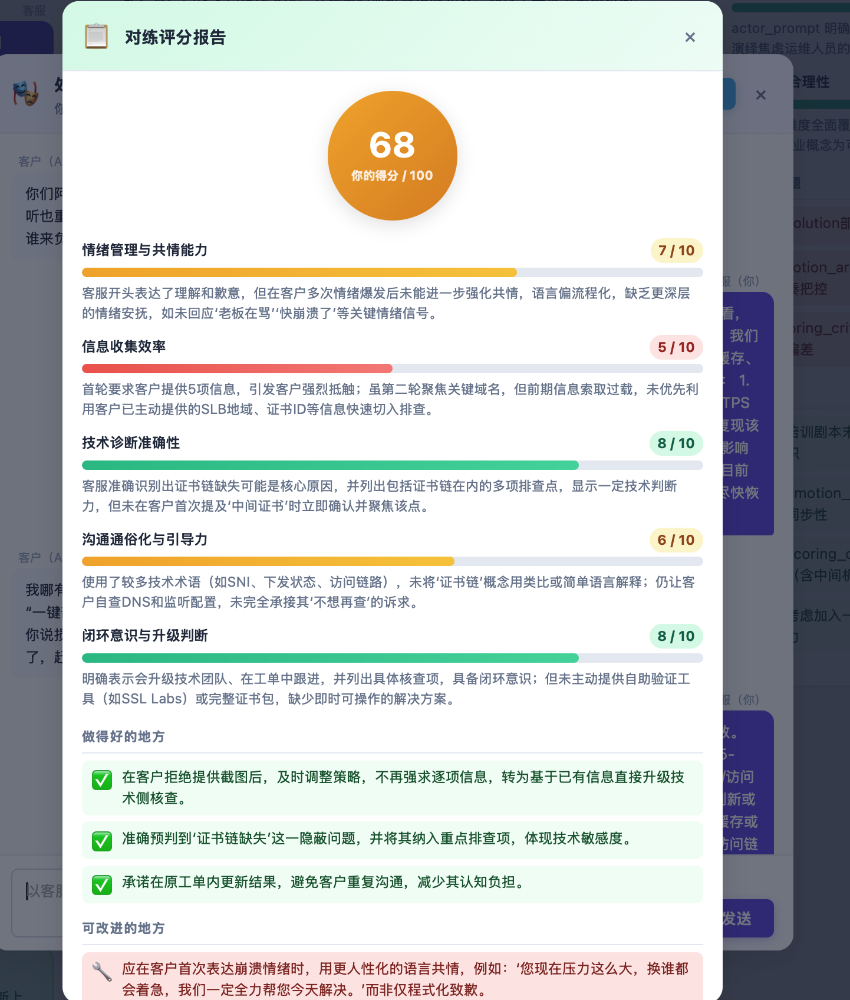
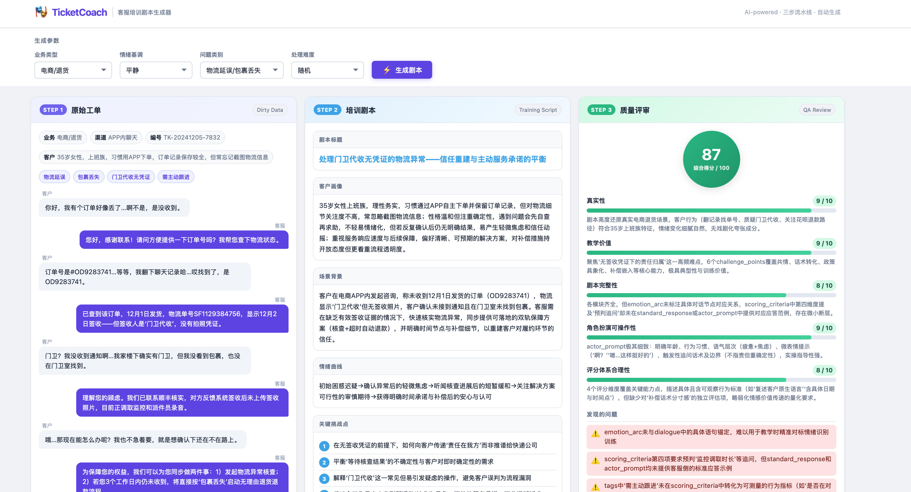

# TicketCoach — 阿里云客服培训陪练系统

> 面向【阿里云（Alibaba Cloud）客服/技术支持】：把真实（脏）工单经多步 LLM 流水线转成培训剧本，再让你与 AI 扮演的客户实战对练并自动评分。

---

## 项目简介

TicketCoach 是一个基于大语言模型的客服培训辅助工具，构成「生成 → 对练 → 评分」完整闭环：

1. **Step 1 — 工单生成**：模拟真实脏数据客服工单（口语化、有错别字、情绪波动）
2. **Step 2 — 剧本提取**：将工单结构化为标准培训角色扮演剧本
3. **Step 3 — 质量审核**：自动评分并给出改进建议
4. **实战对练**：你扮演客服打字，AI 用剧本的 `actor_prompt` 实时扮演该难缠客户，多轮对话
5. **对练评分**：对练结束后，按剧本的 `scoring_criteria` 给你的表现逐维度打分 + 点评

### API 一览

| 方法 | 路径 | 说明 |
|------|------|------|
| POST | `/api/generate` | 跑三步流水线，返回 `{ticket, script, review}` |
| POST | `/api/batch?n=N` | 批量生成 N 条 + 统计 |
| POST | `/api/chat` | 对练一轮：传 `actor_prompt` + 对话历史，返回客户下一句 |
| POST | `/api/evaluate` | 传 `script` + 对练记录，按评分维度给客服打分 |
| GET  | `/api/options` | 前端下拉框选项 |
| GET  | `/api/health` | 健康检查 |

## 本地运行

### 1. 安装依赖

```bash
pip install -r requirements.txt
```

### 2. 配置环境变量

```bash
cp .env.example .env
# 编辑 .env 文件，填入你的 API Key
```

`.env` 文件内容示例：

```
LLM_API_KEY=sk-xxxxxxxxxxxxxxxx
LLM_BASE_URL=https://dashscope.aliyuncs.com/compatible-mode/v1
LLM_MODEL=qwen-plus
```

支持任何兼容 OpenAI API 格式的模型服务，例如：
- 阿里云百炼（通义千问）：`https://dashscope.aliyuncs.com/compatible-mode/v1`
- DeepSeek：`https://api.deepseek.com`

### 3. 启动服务

```bash
uvicorn app.main:app --reload --host 0.0.0.0 --port 8000
```

打开浏览器访问：[http://localhost:8000](http://localhost:8000)

### 4. 命令行模式（仅流水线，不启动服务器）

```bash
python -m core.pipeline
```

---

## Google Cloud Run 部署（推荐，自带公网 HTTPS 链接）

前提：已安装并登录 `gcloud`，项目已开通结算（billing）。本机无需安装 Docker（Cloud Run 在云端构建）。

```bash
# 1) 设定项目与区域
gcloud config set project <你的项目ID>
gcloud config set run/region us-central1

# 2) 从源码构建并部署（首次会提示启用 Cloud Run / Cloud Build 等 API，输入 y）
gcloud run deploy ticketcoach \
  --source . \
  --allow-unauthenticated \
  --timeout 900 \
  --memory 512Mi

# 3) 配置环境变量（key 不进代码/git）
gcloud run services update ticketcoach \
  --set-env-vars LLM_BASE_URL=https://dashscope.aliyuncs.com/compatible-mode/v1,LLM_MODEL=qwen3-max,LLM_API_KEY=<你的key>,ACCESS_PASSWORD=<你设的访问口令>,LLM_TIMEOUT=180
```

部署完成后终端会打印一个 `https://ticketcoach-xxxx.<区域>.run.app` 链接，发给朋友即可访问；
首次打开调用接口时会要求输入你设置的 `ACCESS_PASSWORD`。

> 安全提示：
> - `ACCESS_PASSWORD` 防止别人用你的链接消耗 token；务必设置。
> - 第 3 步把 key 写在命令行会留在 shell 历史里，介意的话改用 Cloud Console（Cloud Run → 服务 → 编辑并部署新修订版本 → 变量与密钥）手动填。
> - `--timeout 900` 给慢模型和批量生成留足时间（qwen3-max 单条约 60s，批量 5 条约 5 分钟）。

## Render 部署（备选）

1. Fork 仓库 → 在 [Render](https://render.com) 新建 **Web Service**
2. Build：`pip install -r requirements.txt`；Start：`uvicorn app.main:app --host 0.0.0.0 --port $PORT`
3. 环境变量配 `LLM_API_KEY` / `LLM_BASE_URL` / `LLM_MODEL` / `ACCESS_PASSWORD`

## 架构图

```
用户浏览器
    │
    ▼
┌─────────────────────────────────────────┐
│           FastAPI (app/main.py)          │
│  GET /          → 前端页面               │
│  POST /api/generate → 单次生成           │
│  POST /api/batch    → 批量生成           │
└────────────────────┬────────────────────┘
                     │
                     ▼
┌─────────────────────────────────────────┐
│         Pipeline (core/pipeline.py)      │
│                                          │
│  ┌──────────┐  ┌──────────┐  ┌────────┐ │
│  │ Step 1   │→ │ Step 2   │→ │Step 3  │ │
│  │工单生成  │  │剧本提取  │  │质量审核│ │
│  └──────────┘  └──────────┘  └────────┘ │
│         ↑ 质量分 < 60 时重新生成 ↑       │
└────────────────────┬────────────────────┘
                     │
                     ▼
┌─────────────────────────────────────────┐
│      LLM API (OpenAI-compatible)         │
│  通义千问 / DeepSeek / 其他              │
└─────────────────────────────────────────┘
```

---

## 截图

### 1. 三步流水线主界面

一键生成：左栏「原始工单」(AI 造的脏数据，含对话气泡/标签)、中栏「培训剧本」(七字段卡片 + `🎭 用这个剧本开始实战对练` 按钮)、右栏「质量评审」(综合分 + 五维评分条)。下图为「云安全 / SSL 证书」场景，质检 92 分。



### 2. 实战对练（你扮客服，AI 扮客户）

点「开始对练」后，AI 用剧本的 `actor_prompt` 实时扮演难缠客户，你以客服身份打字应对；AI 情绪会随你的表现升级或缓和。下图客户因 SSL 证书部署后仍报「不安全」而情绪爆发、施压并要求别再让其逐项截图。



### 3. 对练评分报告

点「结束并评分」，模型按剧本的 `scoring_criteria` 给你的表现逐维度打分，并给出 ✅做得好 / 🔧可改进 / ⚠️未接住的挑战点。下图综合 68 分，点评精准指出「信息索取过载」「共情偏流程化」等问题。



### 4. 生成结果示例

另一条生成结果，展示工单对话、剧本字段与质检维度的完整布局。



---

## 技术栈

- **后端**：Python 3.10+, FastAPI, openai SDK
- **前端**：原生 HTML/CSS/JS（无框架依赖）
- **LLM**：任意 OpenAI-compatible API
